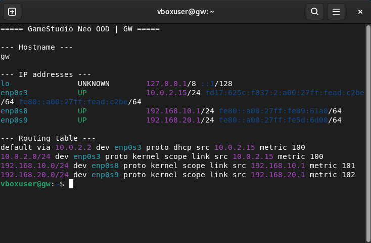
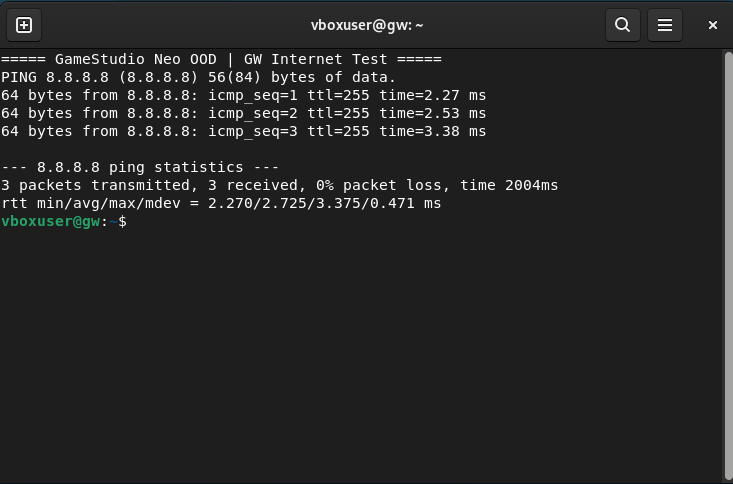
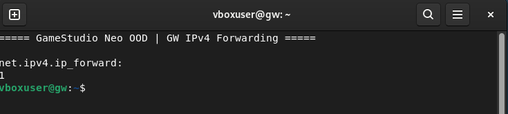
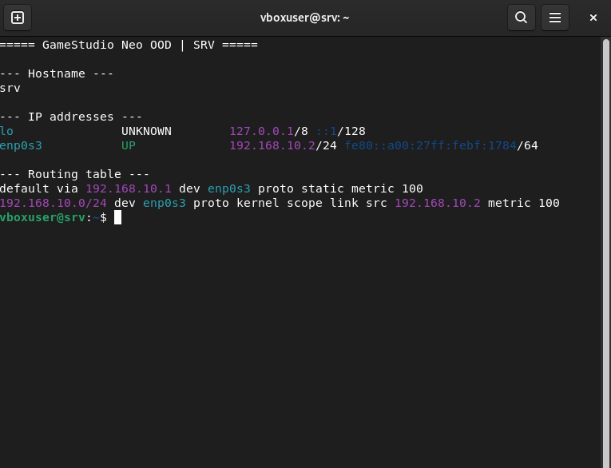
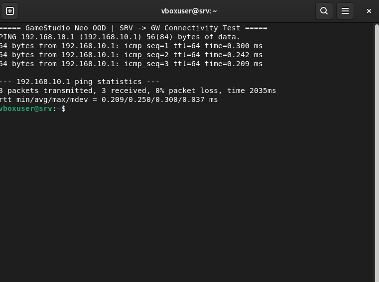
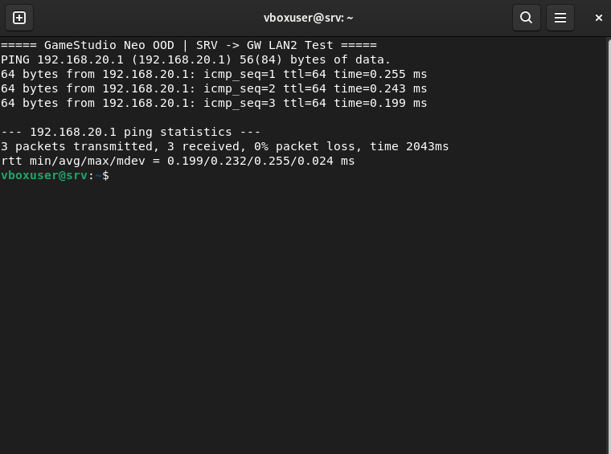

# Доказателства — Сесия 1

Този файл пази доказателства, че базовата среда за GameStudio Neo OOD е конфигурирана и работи. Към него се добавят и screenshots от терминалите и VirtualBox.

## Проверка на gateway-а `gw`

```text
$ hostname
gw

$ ip -br addr
enp0s3  UP  10.0.2.15/24
enp0s8  UP  192.168.10.1/24
enp0s9  UP  192.168.20.1/24

$ ip route
default via 10.0.2.2 dev enp0s3
10.0.2.0/24 dev enp0s3
192.168.10.0/24 dev enp0s8
192.168.20.0/24 dev enp0s9

$ cat /proc/sys/net/ipv4/ip_forward
1

$ ping -c3 8.8.8.8
3 packets transmitted, 3 received, 0% packet loss
```

## Проверка на сървъра `srv`

```text
$ hostname
srv

$ ip -br addr
enp0s3  UP  192.168.10.2/24

$ ip route
default via 192.168.10.1 dev enp0s3
192.168.10.0/24 dev enp0s3

$ ping -c3 192.168.10.1
3 packets transmitted, 3 received, 0% packet loss
```

## Screenshot доказателства

### 1. GW — адреси и routing



### 2. GW — интернет



### 3. GW — IPv4 forwarding



### 4. SRV — адрес и routing



### 5. SRV — ping към GW



### 6. SRV — ping към GW LAN2


- `srv` има успешен ping до `gw`.
- `gw` има успешен достъп до интернет.
- IPv4 forwarding на `gw` е включен.
- Създадени са clean-state snapshots.
